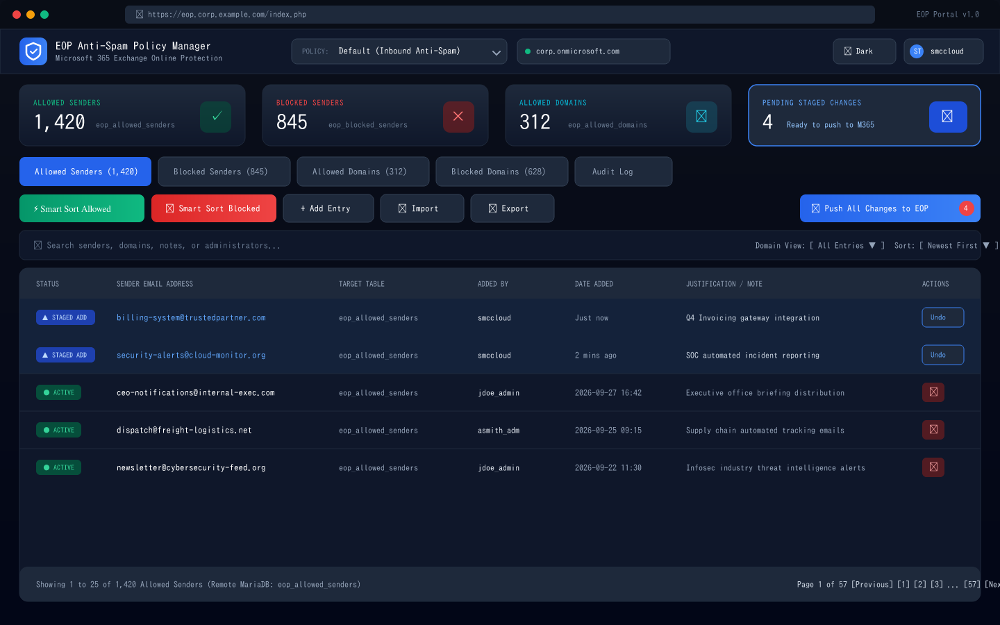
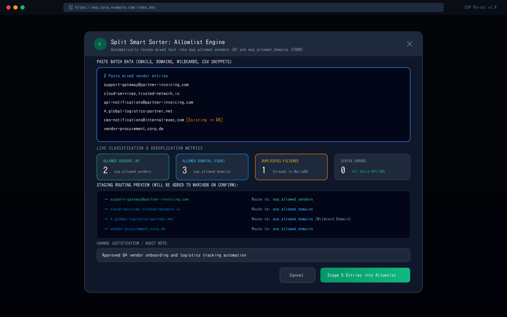
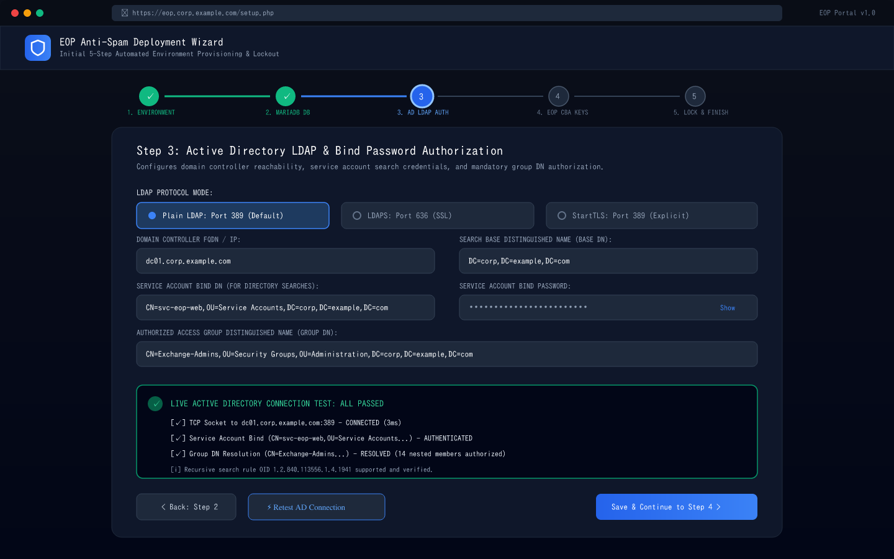
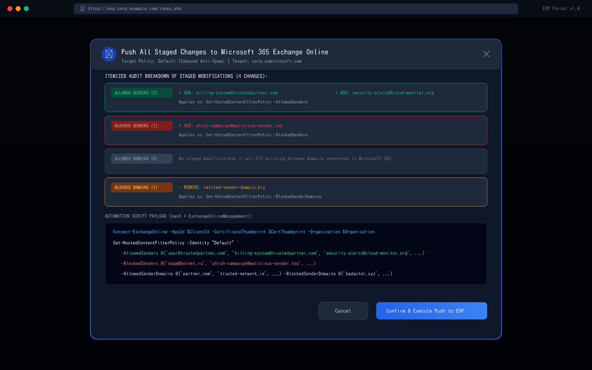
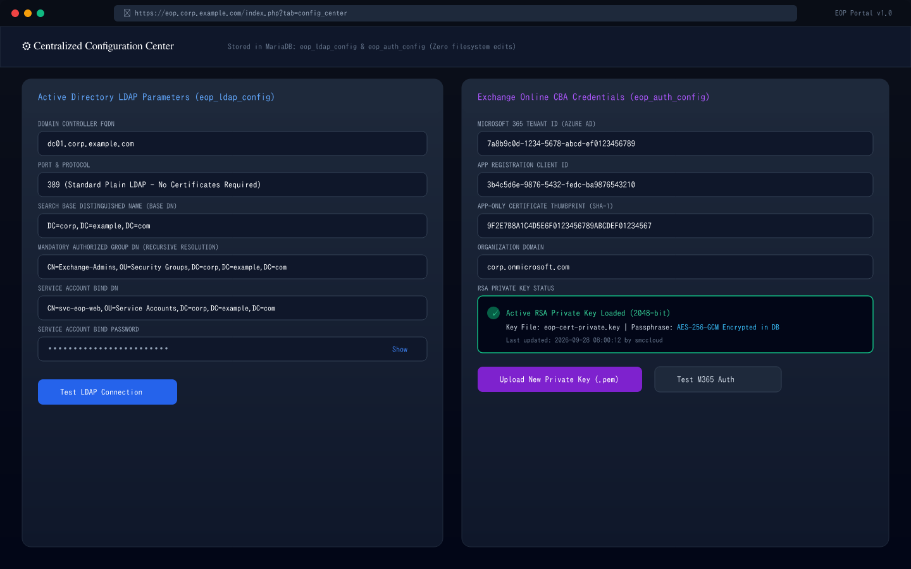

# Exchange Online Protection (EOP) Anti-Spam Policy Manager

A production-ready **PHP 8** web application designed for **Debian Linux** and backed by a **remote MariaDB server** across individual dedicated tables, authenticated via **Microsoft Active Directory (AD) LDAP Group Distinguished Name (Group DN)** with **Service Account Bind Password Authorization**, featuring **Dark Mode**, **App-Only Certificate-Based Authentication (CBA)**, an **Exchange Online PowerShell / Cron automation engine**, and an interactive **React & TypeScript workbench / simulator**.

---

## 📑 Table of Contents

- [Overview & Architecture](#overview--architecture)
- [System Requirements](#system-requirements)
  - [Hardware & Virtual Machine Recommendations](#hardware--virtual-machine-recommendations)
  - [Operating System & Web Server](#operating-system--web-server)
  - [PHP Runtime & Extensions](#php-runtime--extensions)
  - [Package Installation (APT Install Command)](#package-installation-apt-install-command)
  - [Remote MariaDB Database Server](#remote-mariadb-database-server)
  - [Microsoft Active Directory & LDAP](#microsoft-active-directory--ldap)
  - [Microsoft 365 Exchange Online Protection](#microsoft-365-exchange-online-protection)
  - [Network & Firewall Port Matrix](#network--firewall-port-matrix)
  - [Client Browser Requirements](#client-browser-requirements)
- [Screenshots & UI Architecture](#screenshots--ui-architecture)
  - [1. Main Policy Dashboard & Multi-Table Management (Dark Slate Mode)](#1-main-policy-dashboard--multi-table-management-dark-slate-mode)
  - [2. Split Smart Sorter (Allowed & Blocked Real-Time Classification)](#2-split-smart-sorter-allowed--blocked-real-time-classification)
  - [3. 5-Step Initial Deployment Setup Wizard (`setup.php`)](#3-5-step-initial-deployment-setup-wizard-setupphp)
  - [4. Global Push All Changes to EOP (Confirmation & Itemized Audit Summary)](#4-global-push-all-changes-to-eop-confirmation--itemized-audit-summary)
  - [5. Centralized Configuration Center (`config_center` - LDAP & CBA Key Storage)](#5-centralized-configuration-center-config_center---ldap--cba-key-storage)
- [Key Features & Highlights](#key-features--highlights)
  - [Push All Changes to EOP (Global Staging & List-by-List Breakdown)](#push-all-changes-to-eop-global-staging--list-by-list-breakdown)
  - [Split Smart Sorter (Allowed & Blocked Buttons)](#split-smart-sorter-allowed--blocked-buttons)
  - [Active Directory LDAP with Bind Password Authorization](#active-directory-ldap-with-bind-password-authorization)
  - [Emergency Non-LDAP Fallback Administrator](#emergency-non-ldap-fallback-administrator)
  - [Dedicated Table Per List Architecture](#dedicated-table-per-list-architecture)
  - [Exchange Online Certificate-Based Authentication (CBA)](#exchange-online-certificate-based-authentication-cba)
  - [In-App Modals & Duplicate Entry Prevention](#in-app-modals--duplicate-entry-prevention)
  - [Auto-Dismiss Notification Banners & Staged Pending Strips](#auto-dismiss-notification-banners--staged-pending-strips)
- [Initial Run Setup Routine (`setup.php`)](#initial-run-setup-routine-setupphp)
- [Database Schema (9 Dedicated MariaDB Tables)](#database-schema-9-dedicated-mariadb-tables)
- [Active Directory LDAP Authentication & Authorization](#active-directory-ldap-authentication--authorization)
- [Certificate Generation & Setup Guide](#certificate-generation--setup-guide)
  - [1. Microsoft 365 Exchange Online App-Only Certificate (CBA)](#1-microsoft-365-exchange-online-app-only-certificate-cba)
  - [2. Uploading Public Certificate to Microsoft Entra ID (Azure Portal)](#2-uploading-public-certificate-to-microsoft-entra-id-azure-portal)
  - [3. Storing Private Key in EOP Anti-Spam Manager](#3-storing-private-key-in-eop-anti-spam-manager)
  - [4. NGINX HTTPS SSL Web Server Certificates](#4-nginx-https-ssl-web-server-certificates)
- [Exchange Online Protection Sync Engine](#exchange-online-protection-sync-engine)
  - [Scheduled Cron Daemon (Pull-Only)](#scheduled-cron-daemon-pull-only)
  - [Manual Admin Push All (Exchange Online)](#manual-admin-push-all-exchange-online)
- [Web Interface & UX Capabilities](#web-interface--ux-capabilities)
  - [Smart Sorter Classification Engine](#smart-sorter-classification-engine)
  - [Smart Domain Hierarchy Views](#smart-domain-hierarchy-views)
  - [Dark Mode & Audit Trail](#dark-mode--audit-trail)
- [Debian Linux Server Deployment](#debian-linux-server-deployment)
  - [Deployment Overview](#deployment-overview)
  - [Step 1: Remote MariaDB Database Setup & Privileges](#step-1-remote-mariadb-database-setup--privileges)
  - [Step 2: Install Packages on Debian 12 / 13](#step-2-install-packages-on-debian-12--13)
  - [Step 3: Web Application Directory & File Permissions](#step-3-web-application-directory--file-permissions)
  - [Step 4: NGINX Server Block Configuration](#step-4-nginx-server-block-configuration)
  - [Step 5: Exchange Online Management & PowerShell Setup](#step-5-exchange-online-management--powershell-setup)
  - [Step 6: Crontab Background Pull-Only Sync](#step-6-crontab-background-pull-only-sync)
- [Project File Structure & Inventory](#project-file-structure--inventory)
- [Configuration Reference (`config.php`, `.env`, & Database Tables)](#configuration-reference-configphp-env--database-tables)
- [Troubleshooting & FAQ](#troubleshooting--faq)
- [Authors & Co-Contributors](#authors--co-contributors)
- [License](#license)

---

## Overview & Architecture

Microsoft 365 Exchange Online Protection (EOP) allows administrators to configure anti-spam policies (`Set-HostedContentFilterPolicy`) with custom lists of allowed senders, blocked senders, allowed domains, and blocked domains. In enterprise environments, managing these entries directly in PowerShell or the Microsoft Defender Portal can lead to lack of auditability, accidental overwrites, or administrative bottlenecks.

This solution provides:
1. **Centralized Web Portal**: Secure, multi-user web dashboard with dark mode, full search/filter capabilities, smart domain clustering, and CSV export.
2. **Dedicated MariaDB Tables**: Uses an **individual MariaDB table per list** on a remote database server for strict data isolation, indexing, and transactional integrity.
3. **Global Change Staging & Push All**: Any pending additions or removals across **all 4 tables** and policies are staged globally and pushed together to Microsoft 365 in a single operation, with full list-by-list reporting.
4. **Split Smart Sorters (Allowed & Blocked)**: Dedicated one-click intake buttons that parse mixed batches of emails and domains, auto-routing them directly into the appropriate Allowlist or Blocklist tables.
5. **Database-Stored Configuration**: LDAP directory connection settings (`eop_ldap_config`) and Exchange Online authentication credentials (`eop_auth_config`) can be safely modified through the UI without editing server configuration files.
6. **Active Directory Security with Bind Password Authorization**: Restricts system login strictly to members of an authorized **Active Directory Group Distinguished Name (Group DN)**. Supports service account **Bind DN and Bind Password** authorization using standard **plain LDAP (Port 389)**. **LDAPS is NOT required**, removing certificate hassles while optionally supporting LDAPS (Port 636) and StartTLS.
7. **Emergency Non-LDAP Fallback Account**: Provides an emergency local administrative login with enforced password complexity if the Active Directory domain controller is offline or unreachable.
8. **Exchange Online Sync Safeguards**:
   - **Scheduled Cron is strictly Pull-Only**: Never blindly overwrites Microsoft 365 in the background; only pulls remote changes into MariaDB.
   - **Manual Admin Push All**: Pushing MariaDB lists to Microsoft 365 requires an intentional administrator action with pre-push confirmation modals and post-push summaries.
9. **Initial Run Setup Routine (`setup.php`)**: A 5-step deployment wizard that validates database and directory connectivity, builds the schema, and permanently locks itself against re-execution.

---

## System Requirements

The application is engineered for enterprise reliability, predictable performance, and minimal operational overhead. Below are the comprehensive requirements across all infrastructure tiers:

### Hardware & Virtual Machine Recommendations

| Role | Minimum | Recommended | Notes |
|---|---|---|---|
| **Debian Web Server** | 1 vCPU, 1 GB RAM, 10 GB Disk | 2 vCPU, 4 GB RAM, 25 GB SSD | Hosts NGINX, PHP-FPM, and PowerShell Core (`pwsh`) |
| **Remote MariaDB Server** | 1 vCPU, 1 GB RAM, 10 GB Disk | 2 vCPU, 4 GB RAM, 50 GB SSD | Remote database host running MariaDB or MySQL |
| **Network Throughput** | 100 Mbps NIC | 1 Gbps NIC | Low latency (<15ms) to MariaDB & AD Domain Controller |

### Operating System & Web Server

- **Operating System**:
  - **Debian 13 (Trixie)** - *Recommended*
  - **Debian 12 (Bookworm)** - *Supported*
  - **Ubuntu 24.04 LTS / Ubuntu 22.04 LTS** - *Supported*
- **Web Server**:
  - **NGINX 1.18+** (NGINX 1.22+ on Debian 12, NGINX 1.26+ on Debian 13) with FastCGI process manager (`fastcgi_pass unix:/run/php/php-fpm.sock`)
  - HTTP/2 and TLS 1.2 / TLS 1.3 enabled (via reverse proxy or direct Let's Encrypt / enterprise SSL certificates)

### PHP Runtime & Extensions

- **PHP Version**: **PHP 8.1**, **PHP 8.2**, or **PHP 8.3**
- **SAPI**: `php-fpm` (FastCGI Process Manager) and `php-cli` (Command Line Interface for cron jobs)
- **Mandatory PHP Extensions**:
  - `pdo_mysql` (`php-mysql`): Remote MariaDB database connectivity with prepared statements
  - `ldap` (`php-ldap`): Microsoft Active Directory LDAP query and group membership evaluation
  - `curl` (`php-curl`): External HTTP requests and API integrations
  - `mbstring` (`php-mbstring`): Multi-byte UTF-8 string parsing for RFC email address handling
  - `xml` (`php-xml`): XML / DOM parser utilities
  - `zip` (`php-zip`): Bulk archive generation and import processing
  - `openssl` (`php-openssl`): AES-256-GCM encryption for CBA private keys and TLS handshakes

### Remote MariaDB Database Server

- **Engine**: **MariaDB 10.5+**, **10.6+**, **10.11+ LTS** (or **MySQL 8.0+**)
- **Storage Engine**: `InnoDB` (for ACID transactions, row-level locking, and foreign key integrity)
- **Character Set**: `utf8mb4` with collation `utf8mb4_unicode_ci` (full international and emoji compatibility)
- **Network Configuration**:
  - TCP Port **3306** accessible from the Debian web server IP address
  - Remote MariaDB `bind-address` configured to listen on internal LAN or `0.0.0.0`
  - Dedicated database user with `SELECT, INSERT, UPDATE, DELETE, CREATE, INDEX, ALTER` privileges on `eop_antispam_db`

### Microsoft Active Directory & LDAP

- **Domain Controllers**: Windows Server 2012 R2, 2016, 2019, or 2022 Active Directory Domain Services (AD DS)
- **LDAP Protocol Modes**:
  - **Standard Plain LDAP (Port 389)**: *Supported by default*. Does not require enterprise root CA certificates installed on Debian.
  - **LDAPS (Port 636)**: Supported over SSL with `TLS_REQCERT allow` or trusted enterprise CA.
  - **StartTLS (Port 389)**: Supported for explicit TLS upgrades on standard ports.
- **Service Account Requirements**:
  - Standard domain user account with read-only directory query permissions
  - **Bind DN**: (e.g., `CN=svc-eop,OU=Service Accounts,DC=corp,DC=example,DC=com`)
  - **Bind Password**: Stored encrypted in MariaDB table `eop_ldap_config`
- **Group Authorization**:
  - Authorized Active Directory Group Distinguished Name (Group DN)
  - Recursive nested groups supported via LDAP matching rule OID `1.2.840.113556.1.4.1941` (`LDAP_MATCHING_RULE_IN_CHAIN`)

### Microsoft 365 Exchange Online Protection

- **Tenant Access**: Microsoft 365 Commercial, GCC, GCC High, or DoD tenant with active Exchange Online licenses
- **Entra ID (Azure AD) App Registration**:
  - Microsoft Graph / Exchange Online Application Permissions: `Exchange.ManageAsApp`
  - Entra ID Administrator Role: Assigned **Exchange Administrator** or **Global Administrator** role to the App Registration
- **App-Only Certificate-Based Authentication (CBA)**:
  - X.509 RSA 2048-bit or 4096-bit certificate uploaded to the App Registration in Microsoft Entra ID
  - Corresponding RSA Private Key (`.key`, `.pem`, or PKCS#12 `.pfx`) stored in MariaDB `eop_auth_config`
- **PowerShell Execution Environment (Debian Linux)**:
  - **PowerShell Core 7.2+** (`pwsh`) installed on Debian
  - PowerShell Module: `ExchangeOnlineManagement` (v3.0.0 or higher)

### Network & Firewall Port Matrix

| Port | Protocol | Source | Destination | Purpose |
|---|---|---|---|---|
| **80** | TCP | Clients / Reverse Proxy | Debian Web Server | HTTP web portal traffic (auto-redirects to HTTPS) |
| **443** | TCP | Clients / Reverse Proxy | Debian Web Server | HTTPS secure web portal access |
| **3306** | TCP | Debian Web Server | Remote MariaDB Server | Remote database queries & individual table transactions |
| **389** | TCP | Debian Web Server | AD Domain Controller | Active Directory LDAP user authentication & Group DN verification |
| **636** | TCP | Debian Web Server | AD Domain Controller | *Optional*: LDAPS encrypted directory queries |
| **443** | TCP (Outbound) | Debian Web Server | `outlook.office365.com` | Exchange Online PowerShell CBA connection and cmdlet execution |
| **443** | TCP (Outbound) | Debian Web Server | `login.microsoftonline.com` | Microsoft Entra ID OAuth 2.0 token endpoint for CBA authentication |

### Client Browser Requirements

- Modern evergreen web browser:
  - **Google Chrome** (v100+)
  - **Microsoft Edge** (v100+)
  - **Mozilla Firefox** (v100+)
  - **Apple Safari** (v15+)
- Enabled JavaScript and CSS Grid / Flexbox
- No Flash, Silverlight, or legacy ActiveX components required

---

## Screenshots & UI Architecture

The application delivers an enterprise-grade dark-slate user interface, engineered specifically for administrative clarity, rapid intake, and zero-accident deployments to Microsoft 365.

### 1. Main Policy Dashboard & Multi-Table Management (Dark Slate Mode)

The primary interface provides instant visibility into active anti-spam lists, tenant health, search/filter controls, and staged delta modifications.



- **Dedicated List Tabs**: Instant navigation across `eop_allowed_senders`, `eop_blocked_senders`, `eop_allowed_domains`, and `eop_blocked_domains`.
- **Global Staged Changes Badge**: Real-time counter badge on the top action bar (`🚀 Push All Changes to EOP [4]`) tracking uncommitted modifications across all 4 tables.
- **Status Indicators**: Visual differentiation between active synchronized entries (`● ACTIVE`) and pending modifications (`▲ STAGED ADD` with immediate one-click `Undo`).
- **Domain Organization**: Group entries by parent domain clusters, subdomain trees, or Top-Level Domains (`.com`, `.org`, `.net`).

### 2. Split Smart Sorter (Allowed & Blocked Real-Time Classification)

Clicking **"Smart Sort Allowed"** or **"Smart Sort Blocked"** opens an intelligent intake engine that automatically separates mixed bulk text into individual table targets.



- **Automated Syntax Classification**: Distinguishes RFC-compliant email addresses (`@`) from Fully Qualified Domain Names (FQDNs and wildcards like `*.partner.com`).
- **Real-Time Deduplication**: Validates inputs against both current remote MariaDB database records and within the submitted batch.
- **Routing Summary**: Displays live metrics (Allowed Senders, Allowed Domains, Duplicates Filtered, Syntax Errors) before staging records.

### 3. 5-Step Initial Deployment Setup Wizard (`setup.php`)

Runs on initial server deployment to configure remote database tables, test Active Directory LDAP binding, register CBA certificates, and create the permanent lockout flag.



- **Environment Prerequisite Validation**: Automated checks for PHP 8.1+, `pdo_mysql`, `ldap`, `openssl`, and `curl`.
- **Active Directory Verification**: Real-time connection testing verifying Domain Controller reachability, service account Bind DN/Password authorization, and recursive Group DN resolution.
- **Permanent Lockout**: Writes an immutable filesystem lock (`installed.lock`) and updates MariaDB table `eop_setup_lock` to block subsequent wizard execution.

### 4. Global Push All Changes to EOP (Confirmation & Itemized Audit Summary)

Clicking **"Push All Changes to EOP"** reviews all staged modifications across all 4 tables and outputs an itemized list-by-list audit report.



- **Pre-Push Confirmation Modal**: Displays an itemized breakdown of staged additions and removals for each of the 4 policy tables.
- **PowerShell Execution Payload**: Shows the exact command (`Set-HostedContentFilterPolicy`) executed via Certificate-Based Authentication on Linux.
- **Audit Log Verification**: Records user identity, timestamp, IP address, and changed items into `eop_audit_log`.

### 5. Centralized Configuration Center (`config_center` - LDAP & CBA Key Storage)

Administrators can update Active Directory LDAP parameters and rotate Exchange Online RSA private keys directly in the database without modifying server filesystem configuration files.



- **Database-Stored Configuration**: LDAP directory connection settings (`eop_ldap_config`) and Exchange Online authentication credentials (`eop_auth_config`) modified directly from the UI.
- **AES-256-GCM Encryption**: Protects sensitive RSA private key passphrases and service account credentials stored in MariaDB.
- **Live Connection Diagnostics**: Dedicated action buttons to test Active Directory LDAP binding and Microsoft 365 CBA authentication on demand.

---

## Key Features & Highlights

### Push All Changes to EOP (Global Staging & List-by-List Breakdown)

- **Cross-Table Global Staging**:
  - Additions and deletions across all 4 anti-spam tables (`eop_allowed_senders`, `eop_blocked_senders`, `eop_allowed_domains`, and `eop_blocked_domains`) are staged into a unified pending change queue.
  - The administrator does not need to push each table individually; clicking **"Push All Changes to EOP"** pushes all pending modifications across all lists and policies in a single, atomic operation.
  - Dynamic pending change counter badges on the action bar and navigation bar display the exact number of staged changes waiting to be pushed.
- **Pre-Push Confirmation Modal**:
  - Outlines the policy name, target tenant, and an itemized breakdown of staged additions and removals for each of the 4 tables.
- **Post-Push Result Notification & Audit Summary**:
  - Immediately following push execution, an informative modal and banner clearly detail:
    - **Allowed Senders**: Exact items added or removed (or confirmation that existing entries were preserved).
    - **Blocked Senders**: Exact items added or removed.
    - **Allowed Domains**: Exact items added or removed.
    - **Blocked Domains**: Exact items added or removed.
    - Resulting active EOP list entries in Microsoft 365.
    - The executed PowerShell cmdlet (`Set-HostedContentFilterPolicy`).
    - Recorded audit log entry in `eop_audit_log`.

### Split Smart Sorter (Allowed & Blocked Buttons)

The unified intake engine is split into two dedicated, color-coded buttons on the list toolbar:

1. **Smart Sort Allowed** (Emerald/Green theme with shield icon):
   - Directly targets `eop_allowed_senders` and `eop_allowed_domains`.
   - Automatically routes email addresses containing `@` into the Allowed Senders table.
   - Automatically routes domain names (including wildcards like `*.partner.com`) into the Allowed Domains table.
2. **Smart Sort Blocked** (Rose/Red theme with ban icon):
   - Directly targets `eop_blocked_senders` and `eop_blocked_domains`.
   - Automatically routes email addresses containing `@` into the Blocked Senders table.
   - Automatically routes domain names into the Blocked Domains table.
3. **Real-Time Classification & Deduplication Engine**:
   - Syntax validation for RFC-compliant email addresses and valid domain names.
   - Duplicate prevention against current MariaDB table records and within the batch.
   - Live visual preview displaying sender count, domain count, duplicate count, and batch routing breakdown before committing.

### Active Directory LDAP with Bind Password Authorization

- **Standard Plain LDAP (Port 389) Supported by Default**: LDAPS is **not required**. Connects directly to Windows Domain Controllers without importing internal CA certificates on Debian. Also supports LDAPS (636) and StartTLS (389).
- **Service Account Bind Password Authorization**:
  - Supports entering an authorized service account **Bind DN** and **Bind Password** used by `LdapAuth` to authenticate against Active Directory before querying group memberships.
  - Stored securely in MariaDB `eop_ldap_config` table.
  - Password visibility toggle (Show/Hide) and lock indicator in the setup wizard and Keys & LDAP settings view.
- **Group Distinguished Name (Group DN) Access Control**:
  - Evaluates recursive / nested group membership using LDAP matching rule OID `1.2.840.113556.1.4.1941` (`LDAP_MATCHING_RULE_IN_CHAIN`).
- **Live Connection & Authorization Test**:
  - Interactive test utility verifying domain controller reachability, bind credentials, Base DN resolution, and Group DN lookup.

### Emergency Non-LDAP Fallback Administrator

- In the event of an Active Directory domain controller outage or network isolation, an emergency local fallback administrator account can be configured during initial setup or in `config.php`.
- **Enforced Password Policy**: Minimum 12 characters requiring at least three character categories (uppercase, lowercase, numbers, special characters).
- Stored as a secure PHP `password_hash()` (Bcrypt / Argon2id).

### Dedicated Table Per List Architecture

- Each list resides in its own dedicated MariaDB table:
  - `eop_allowed_senders`
  - `eop_blocked_senders`
  - `eop_allowed_domains`
  - `eop_blocked_domains`
- Additional dedicated tables support audit logging (`eop_audit_log`), policy registries (`eop_policies`), runtime LDAP settings (`eop_ldap_config`), Exchange Online certificates (`eop_auth_config`), and setup lockout (`eop_setup_lock`).

### Exchange Online Certificate-Based Authentication (CBA)

- Secure, secretless app-only authentication to Exchange Online Protection.
- RSA private key (`.pem`, `.key`, `.pfx`) stored in MariaDB `eop_auth_config`.
- Passphrase encrypted using **AES-256-GCM** before writing to the database.

### In-App Modals & Duplicate Entry Prevention

- Designed specifically for modern sandboxed environments (where browser `alert()` or `confirm()` are blocked).
- **Duplicate Entry Warning Modal**: Pops up immediately if an administrator attempts to add an existing email or domain, displaying who added the original record, timestamp, and justification note.
- **Delete Confirmation Modal**: Clear verification dialog before staging deletions.

### Auto-Dismiss Notification Banners & Staged Pending Strips

To keep the interface clean, compact, and responsive, items that appear dynamically between the action toolbar buttons and the anti-spam list automatically dismiss:
- **Global Notification Banner**: Success, warning, and operational status alerts automatically dismiss after **5 seconds** with a smooth fade animation. An immediate "Dismiss" button with an `X` icon is also available for instant closure.
- **Staged Pending Changes Notice Strip**: When additions or deletions are staged across any of the 4 tables, an informative blue summary strip appears between the toolbar buttons and the list detailing what was staged, and automatically dismisses after **6 seconds**. Persistent badges on the **"Push All Changes to EOP"** action button and top navigation bar maintain continuous visibility of pending counts without permanently shifting the table layout.

---

## Initial Run Setup Routine (`setup.php`)

The application features an automated initial setup routine (`setup.php`) executed upon first deployment:

1. **Step 1 - Requirements & Environment Check**:
   - Verifies PHP 8.1+, PDO MySQL extension, OpenSSL, and LDAP module (`php-ldap`).
2. **Step 2 - Remote MariaDB Database Setup**:
   - Collects host, port, database name, and credentials.
   - Tests remote database connectivity and populates all 9 required schema tables.
3. **Step 3 - Active Directory LDAP & Fallback Admin**:
   - Configures Domain Controller host, port, protocol (Plain LDAP 389, LDAPS 636, StartTLS), Base DN, **Service Account Bind DN**, and **Bind Password for LDAP Authorization**.
   - Configures the mandatory **Authorized Group DN** with live bind testing.
   - Optionally configures the emergency non-LDAP fallback administrator.
4. **Step 4 - Microsoft 365 Exchange Online Protection (EOP)**:
   - Configures Tenant ID, Client App ID, Certificate Thumbprint, Organization Domain, and the target anti-spam policy.
   - **Policy identified by name *or* GUID**: a single field accepts either the policy display name or its Exchange GUID (`Get-HostedContentFilterPolicy -Identity` takes either). A GUID is canonicalised to lowercase `8-4-4-4-12` and the field shows a live *Name* / *GUID* badge as you type.
   - **Exchange verification** (on by default): connects with the uploaded PKCS#12 bundle and calls `Get-HostedContentFilterPolicy`. A policy Exchange does not recognise is rejected outright; a GUID that resolves is written back as the policy display name so every policy-keyed list in MariaDB stays consistent. If the lookup cannot run at all (no `pwsh`, no route to the tenant) the identifier is saved as entered and an amber warning is shown. Untick the checkbox to skip the lookup entirely.
   - **Upload Private Key Button**: Directly upload `.pem`, `.key`, or `.txt` private key files with client-side parsing and server-side multipart support, or paste the PEM block manually.
5. **Step 5 - Review & Permanent Security Lock**:
   - Summarizes all configured parameters, including the resolved policy name, its GUID, and whether it was verified against Exchange Online.
   - Promotes the Step 4 policy to the active default in `eop_policies` (`is_default = 1`).
   - Writes `config.php` and creates a filesystem lock file (`installed.lock`) alongside the MariaDB `eop_setup_lock` table.
   - **Strict Re-Run Prevention**: Subsequent requests to `setup.php` immediately respond with **403 Forbidden** and cannot be re-executed without deliberate root-level intervention.

---

## Database Schema (9 Dedicated MariaDB Tables)

All policy lists and system configurations are stored across individual dedicated tables on your remote MariaDB server:

```sql
CREATE DATABASE IF NOT EXISTS `eop_antispam_db` 
  DEFAULT CHARACTER SET utf8mb4 
  COLLATE utf8mb4_unicode_ci;

USE `eop_antispam_db`;

-- 1. Allowed Senders Table
CREATE TABLE IF NOT EXISTS `eop_allowed_senders` (
  `id` INT UNSIGNED AUTO_INCREMENT PRIMARY KEY,
  `policy_name` VARCHAR(128) NOT NULL,
  `sender_email` VARCHAR(255) NOT NULL,
  `note` TEXT NULL,
  `added_by` VARCHAR(128) NOT NULL,
  `created_at` DATETIME NOT NULL DEFAULT CURRENT_TIMESTAMP,
  `updated_at` DATETIME NOT NULL DEFAULT CURRENT_TIMESTAMP ON UPDATE CURRENT_TIMESTAMP,
  UNIQUE KEY `uk_policy_sender` (`policy_name`, `sender_email`),
  INDEX `idx_sender_email` (`sender_email`)
) ENGINE=InnoDB;

-- 2. Blocked Senders Table
CREATE TABLE IF NOT EXISTS `eop_blocked_senders` (
  `id` INT UNSIGNED AUTO_INCREMENT PRIMARY KEY,
  `policy_name` VARCHAR(128) NOT NULL,
  `sender_email` VARCHAR(255) NOT NULL,
  `note` TEXT NULL,
  `added_by` VARCHAR(128) NOT NULL,
  `created_at` DATETIME NOT NULL DEFAULT CURRENT_TIMESTAMP,
  `updated_at` DATETIME NOT NULL DEFAULT CURRENT_TIMESTAMP ON UPDATE CURRENT_TIMESTAMP,
  UNIQUE KEY `uk_policy_blocked_sender` (`policy_name`, `sender_email`),
  INDEX `idx_blocked_sender` (`sender_email`)
) ENGINE=InnoDB;

-- 3. Allowed Domains Table
CREATE TABLE IF NOT EXISTS `eop_allowed_domains` (
  `id` INT UNSIGNED AUTO_INCREMENT PRIMARY KEY,
  `policy_name` VARCHAR(128) NOT NULL,
  `domain_name` VARCHAR(255) NOT NULL,
  `note` TEXT NULL,
  `added_by` VARCHAR(128) NOT NULL,
  `created_at` DATETIME NOT NULL DEFAULT CURRENT_TIMESTAMP,
  `updated_at` DATETIME NOT NULL DEFAULT CURRENT_TIMESTAMP ON UPDATE CURRENT_TIMESTAMP,
  UNIQUE KEY `uk_policy_domain` (`policy_name`, `domain_name`),
  INDEX `idx_domain_name` (`domain_name`)
) ENGINE=InnoDB;

-- 4. Blocked Domains Table
CREATE TABLE IF NOT EXISTS `eop_blocked_domains` (
  `id` INT UNSIGNED AUTO_INCREMENT PRIMARY KEY,
  `policy_name` VARCHAR(128) NOT NULL,
  `domain_name` VARCHAR(255) NOT NULL,
  `note` TEXT NULL,
  `added_by` VARCHAR(128) NOT NULL,
  `created_at` DATETIME NOT NULL DEFAULT CURRENT_TIMESTAMP,
  `updated_at` DATETIME NOT NULL DEFAULT CURRENT_TIMESTAMP ON UPDATE CURRENT_TIMESTAMP,
  UNIQUE KEY `uk_policy_blocked_domain` (`policy_name`, `domain_name`),
  INDEX `idx_blocked_domain` (`domain_name`)
) ENGINE=InnoDB;

-- 5. Audit Trail Log Table
CREATE TABLE IF NOT EXISTS `eop_audit_log` (
  `id` BIGINT UNSIGNED AUTO_INCREMENT PRIMARY KEY,
  `action` VARCHAR(32) NOT NULL,
  `target_table` VARCHAR(64) NOT NULL,
  `policy_name` VARCHAR(128) NOT NULL,
  `target_value` VARCHAR(255) NOT NULL,
  `username` VARCHAR(128) NOT NULL,
  `details` TEXT NULL,
  `ip_address` VARCHAR(45) NOT NULL,
  `timestamp` DATETIME NOT NULL DEFAULT CURRENT_TIMESTAMP,
  INDEX `idx_policy_timestamp` (`policy_name`, `timestamp`)
) ENGINE=InnoDB;

-- 6. Anti-Spam Policy Registry Table
CREATE TABLE IF NOT EXISTS `eop_policies` (
  `id` INT UNSIGNED AUTO_INCREMENT PRIMARY KEY,
  `policy_name` VARCHAR(128) NOT NULL UNIQUE,
  `description` VARCHAR(255) NULL,
  `last_synced_at` DATETIME NULL,
  `sync_status` VARCHAR(32) DEFAULT 'PENDING',
  `created_at` DATETIME NOT NULL DEFAULT CURRENT_TIMESTAMP
) ENGINE=InnoDB;

-- 7. Database-Stored LDAP Connection Configuration Table (With Bind Password)
CREATE TABLE IF NOT EXISTS `eop_ldap_config` (
  `id` INT UNSIGNED AUTO_INCREMENT PRIMARY KEY,
  `host` VARCHAR(255) NOT NULL,
  `port` INT UNSIGNED NOT NULL DEFAULT 389,
  `protocol` ENUM('ldap', 'ldaps', 'starttls') NOT NULL DEFAULT 'ldap',
  `use_ssl` TINYINT(1) NOT NULL DEFAULT 0,
  `use_tls` TINYINT(1) NOT NULL DEFAULT 0,
  `base_dn` VARCHAR(255) NOT NULL,
  `authorized_group_dn` VARCHAR(500) NOT NULL,
  `bind_dn` VARCHAR(255) NULL DEFAULT '',
  `bind_password` VARCHAR(255) NULL DEFAULT '',
  `account_suffix` VARCHAR(100) NULL DEFAULT '@corp.example.com',
  `netbios_domain` VARCHAR(50) NULL DEFAULT 'CORP',
  `timeout_seconds` INT UNSIGNED NOT NULL DEFAULT 5,
  `is_active` TINYINT(1) NOT NULL DEFAULT 1,
  `updated_by` VARCHAR(100) NOT NULL DEFAULT 'SYSTEM',
  `created_at` DATETIME NOT NULL DEFAULT CURRENT_TIMESTAMP,
  `updated_at` DATETIME NOT NULL DEFAULT CURRENT_TIMESTAMP ON UPDATE CURRENT_TIMESTAMP,
  INDEX `idx_ldap_active` (`is_active`)
) ENGINE=InnoDB;

-- 8. Database-Stored Exchange Online CBA Credentials Table
CREATE TABLE IF NOT EXISTS `eop_auth_config` (
  `id` INT UNSIGNED AUTO_INCREMENT PRIMARY KEY,
  `tenant_id` VARCHAR(100) NOT NULL,
  `client_id` VARCHAR(100) NOT NULL,
  `certificate_thumbprint` VARCHAR(100) NOT NULL,
  `organization` VARCHAR(255) NOT NULL,
  `key_filename` VARCHAR(255) NOT NULL DEFAULT 'eop-cert-private.key',
  `private_key_pem` MEDIUMTEXT NOT NULL,
  `encrypted_passphrase` TEXT NULL,
  `auth_type` VARCHAR(50) NOT NULL DEFAULT 'CertificateThumbprint',
  `is_active` TINYINT(1) NOT NULL DEFAULT 1,
  `updated_by` VARCHAR(100) NOT NULL DEFAULT 'SYSTEM',
  `created_at` DATETIME NOT NULL DEFAULT CURRENT_TIMESTAMP,
  `updated_at` DATETIME NOT NULL DEFAULT CURRENT_TIMESTAMP ON UPDATE CURRENT_TIMESTAMP
) ENGINE=InnoDB;

-- 9. Setup Wizard Lockout Table
CREATE TABLE IF NOT EXISTS `eop_setup_lock` (
  `id` INT UNSIGNED AUTO_INCREMENT PRIMARY KEY,
  `is_locked` TINYINT(1) NOT NULL DEFAULT 1,
  `locked_at` DATETIME NOT NULL DEFAULT CURRENT_TIMESTAMP,
  `locked_by_ip` VARCHAR(45) NOT NULL,
  `install_version` VARCHAR(20) NOT NULL DEFAULT '1.0.0'
) ENGINE=InnoDB;
```

---

## Active Directory LDAP Authentication & Authorization

The application queries Active Directory connection parameters directly from the `eop_ldap_config` table:

1. **Service Account Bind Authorization**:
   - If a service account Bind DN and Bind Password are configured in `eop_ldap_config`, `LdapAuth` first binds using those credentials:
     ```php
     $serviceBound = @ldap_bind($this->ldapConn, $this->ldapConfig['bind_dn'], $this->ldapConfig['bind_pass']);
     ```
   - If no service account is configured, anonymous or direct user bind is used.
2. **User Search & Authentication**:
   - Searches for the user by `sAMAccountName` or `userPrincipalName` under `base_dn`:
     ```ldap
     (|(sAMAccountName=<USER>)(userPrincipalName=<USER>))
     ```
   - Re-binds using the resolved user DN and provided credentials to verify password authenticity.
3. **Access Control via Group Distinguished Name**:
   - Evaluates whether the user belongs to the required `authorized_group_dn`:
     ```ldap
     (&(objectCategory=user)(sAMAccountName=<USER>)(memberOf:1.2.840.113556.1.4.1941:=<GROUP_DN>))
     ```
   - Supports **nested/recursive Active Directory groups** using LDAP matching rule OID `1.2.840.113556.1.4.1941` (`LDAP_MATCHING_RULE_IN_CHAIN`).
4. **Session Security**:
   - `session_regenerate_id(true)` upon successful login.
   - Inactivity timeout (default: 60 minutes).
   - Strict CSRF token validation on every POST/action request.

---

## Exchange Online Protection Sync Engine

### Scheduled Cron Daemon (Pull-Only)

To prevent unintended overwrites of Microsoft 365 policies, the background cron daemon (`cron-sync.php --action=pull`) is **strictly pull-only**:
- It targets the **default policy configured in the Setup Wizard** (stored in `.env` as `EOP_POLICY_NAME` and in `config.php` as `DEFAULT_POLICY_NAME`, with the resolved GUID alongside it in `EOP_POLICY_GUID` / `DEFAULT_POLICY_GUID`). `-Identity` accepts either the name or the GUID.
- It pulls remote entries from Microsoft 365 using `Get-HostedContentFilterPolicy`.
- Discovered entries are reconciled into the corresponding MariaDB tables without modifying Exchange Online.

```powershell
# Scheduled Cron (Pull Only): Reconcile remote changes into MariaDB for the default policy
Get-HostedContentFilterPolicy -Identity "Default"
```

### Manual Admin Push All (Exchange Online)

Pushing local MariaDB changes to Microsoft 365 is an intentional administrative action:
- **Global Scope**: Pushes all pending staged additions and removals across **all 4 tables** (`eop_allowed_senders`, `eop_blocked_senders`, `eop_allowed_domains`, and `eop_blocked_domains`) and policies at once.
- **PowerShell Execution**: Connects via Certificate-Based Authentication and updates all 4 lists:
  ```powershell
  Connect-ExchangeOnline -AppId $ClientId -CertificateThumbprint $CertThumbprint -Organization $Organization
  Set-HostedContentFilterPolicy -Identity $PolicyName `
    -AllowedSenders $AllowedSenders `
    -BlockedSenders $BlockedSenders `
    -AllowedSenderDomains $AllowedDomains `
    -BlockedSenderDomains $BlockedDomains
  ```
- **List-by-List Push Summary**: Displays a breakdown of exactly what additions and removals were pushed to each list (e.g. Added 3 senders to Allowed Senders, Removed 1 domain from Blocked Domains, etc.) and records the audit log in `eop_audit_log`.

---

## Web Interface & UX Capabilities

### Smart Sorter Classification Engine

- **Smart Sort Allowed**: Paste mixed text of email addresses and domain names to automatically route valid emails to Allowed Senders and domain names to Allowed Domains.
- **Smart Sort Blocked**: Paste mixed text of email addresses and domain names to automatically route valid emails to Blocked Senders and domain names to Blocked Domains.
- Live syntax validation, real-time duplicate detection against active policy tables, and preview badge counters before committing.

### Smart Domain Hierarchy Views

- **Domain Cluster**: Groups subdomains under their parent domain (e.g., `api.service.corp.com` under `corp.com`).
- **Subdomain Tree**: Visual tree-nested display showing root domain and branch subdomains.
- **TLD Group**: Organizes entries by Top-Level Domain (`.com`, `.net`, `.io`, `.gov`).
- **Standard A-Z**: Alphabetical sorting by entry value or date added.

### Dark Mode & Audit Trail

- High-contrast **Dark Mode** and clean **Light Mode** toggled with a single click.
- Real-time **Audit Log** tab tracking additions, deletions, bulk imports, and sync runs with user identity, timestamp, and client IP address.

---

## Certificate Generation & Setup Guide

This application utilizes two distinct certificates:
1. **Microsoft 365 Exchange Online App-Only Certificate (CBA)**: Used by `sync-exchange.ps1` and `Connect-ExchangeOnline` for Certificate-Based Authentication without client secrets or interactive login.
2. **NGINX HTTPS SSL Certificate**: Used by Debian NGINX to secure web browser access over TLS (port 443).

Below are the complete, step-by-step directions for generating, inspecting, and installing both certificates.

---

### 1. Microsoft 365 Exchange Online App-Only Certificate (CBA)

The certificate must be an X.509 certificate with an RSA key length of at least 2048 bits (4096 bits recommended for enhanced security).

#### Method A: Linux / Debian OpenSSL (Recommended)

Run the following commands on your Debian server or administrator workstation:

```bash
# Step 1: Create a dedicated directory for certificates
mkdir -p ~/eop-certs && cd ~/eop-certs

# Step 2: Generate an RSA 2048-bit (or 4096-bit) private key with AES-256 passphrase encryption
openssl genrsa -aes256 -passout pass:"YourSecurePassphraseHere" -out eop-cert-private.key 2048

# Step 3: Generate the self-signed public certificate (valid for 2 years / 730 days)
openssl req -new -x509 -key eop-cert-private.key -passin pass:"YourSecurePassphraseHere" \
  -days 730 -out eop-cert-public.crt \
  -subj "/CN=EOP Anti-Spam Policy Manager/O=YourOrganization"

# Step 4: Extract the SHA-1 Certificate Thumbprint (required for App Registration & config)
openssl x509 -in eop-cert-public.crt -noout -fingerprint -sha1 | tr -d ':' | sed 's/SHA1 Fingerprint=//'
# Example output: 9A2F8B3C1D4E5F6A7B8C9D0E1F2A3B4C5D6E7F80

# Step 5 (Optional): Also create a PKCS#12 (.pfx) bundle for Windows/PowerShell portability
openssl pkcs12 -export -out eop-cert.pfx -inkey eop-cert-private.key \
  -in eop-cert-public.crt -passin pass:"YourSecurePassphraseHere" \
  -passout pass:"YourSecurePassphraseHere"
```

**Files produced:**
- `eop-cert-public.crt` (or `.cer`): The **public certificate** to upload to Microsoft Entra ID.
- `eop-cert-private.key`: The **private key PEM** to paste into the setup wizard (`setup.php`) or database (`eop_auth_config`).
- Your passphrase: Used to decrypt the key (stored as AES-256-GCM encrypted in MariaDB).

#### Method B: Windows PowerShell (`New-SelfSignedCertificate`)

If generating on a Windows management workstation:

```powershell
# Step 1: Generate self-signed certificate in CurrentUser personal store
$cert = New-SelfSignedCertificate `
  -CertStoreLocation "Cert:\CurrentUser\My" `
  -Subject "CN=EOP Anti-Spam Policy Manager" `
  -KeySpec Signature `
  -KeyLength 2048 `
  -KeyExportPolicy Exportable `
  -HashAlgorithm SHA256 `
  -NotAfter (Get-Date).AddYears(2)

# Step 2: Export public certificate (.cer) for Microsoft Entra ID upload
Export-Certificate -Cert $cert -FilePath ".\eop-cert-public.cer"

# Step 3: Export password-protected private key (.pfx)
$password = ConvertTo-SecureString -String "YourSecurePassphraseHere" -Force -AsPlainText
Export-PfxCertificate -Cert $cert -FilePath ".\eop-cert.pfx" -Password $password

# Step 4: Extract the RSA Private Key PEM text (using OpenSSL on Windows or Linux):
# openssl pkcs12 -in eop-cert.pfx -nocerts -nodes -out eop-cert-private.key

# Step 5: Output SHA-1 Thumbprint:
$cert.Thumbprint
# Example: 9A2F8B3C1D4E5F6A7B8C9D0E1F2A3B4C5D6E7F80
```

---

### 2. Uploading Public Certificate to Microsoft Entra ID (Azure Portal)

Once you have generated `eop-cert-public.crt` (or `.cer`):

1. Sign in to the **[Microsoft Entra Admin Center](https://entra.microsoft.com/)** or **[Azure Portal](https://portal.azure.com/)**.
2. Navigate to **Identity** > **Applications** > **App registrations**.
3. Select your application (or create a new registration named `EOP Anti-Spam Manager`).
4. In the left navigation, click **Certificates & secrets** > **Certificates** tab.
5. Click **Upload certificate**.
6. Select your `eop-cert-public.crt` (or `eop-cert-public.cer`) file and enter a description (e.g., `EOP Debian Web Server Key 2026`).
7. Click **Add**.
8. Verify the displayed **Thumbprint** matches your extracted SHA-1 thumbprint!
9. In **API permissions**, grant the application:
   - **Office 365 Exchange Online**: `Exchange.ManageAsApp` (Application permission).
10. Click **Grant admin consent for [Your Organization]**.
11. In Entra ID **Roles and administrators**, assign your App Registration the **Exchange Administrator** role.

---

### 3. Storing Private Key in EOP Anti-Spam Manager

You have two simple ways to provide the private key to the application:

1. **During Initial Setup Wizard (`setup.php`)**:
   - In **Step 4**, click **Upload Private Key File (.pem, .key)** to choose your local certificate key file, or paste the content of `eop-cert-private.key` into the **RSA Certificate Private Key (PEM format)** field.
   - Enter your passphrase into the **Private Key Passphrase** field.
   - Enter the **Certificate Thumbprint**, **Client ID**, and **Tenant ID**.
   - Click **Test EOP Key Authentication** to verify encryption roundtrip.
2. **Via Centralized Configuration Center (`/index.php?tab=config_center`)**:
   - Authorized administrators can upload new keys and rotate certificates directly from the web interface without restarting NGINX or touching server files.
   - Passphrases are stored strictly encrypted via **AES-256-GCM** in the `eop_auth_config` table.

---

### 4. NGINX HTTPS SSL Web Server Certificates

To encrypt browser sessions connecting to the web portal:

#### Option A: Let's Encrypt / Certbot (Automated Production HTTPS)

If your Debian server has an external domain or public DNS record:

```bash
# 1. Install Certbot NGINX plugin
sudo apt update && sudo apt install -y certbot python3-certbot-nginx

# 2. Automatically obtain and configure SSL certificate
sudo certbot --nginx -d eop.corp.example.com

# 3. Certbot automatically configures renewal via systemd timer:
sudo systemctl status certbot.timer
```

#### Option B: OpenSSL Self-Signed Certificate (Internal LAN / Testing)

For internal networks without public DNS:

```bash
# 1. Create SSL certificate and private key in standard Debian locations:
sudo openssl req -x509 -nodes -days 730 -newkey rsa:2048 \
  -keyout /etc/ssl/private/ssl-cert-snakeoil.key \
  -out /etc/ssl/certs/ssl-cert-snakeoil.pem \
  -subj "/CN=eop.corp.example.com/O=Enterprise Anti-Spam Management"

# 2. Lock down private key permissions:
sudo chmod 600 /etc/ssl/private/ssl-cert-snakeoil.key
sudo chown root:root /etc/ssl/private/ssl-cert-snakeoil.key

# 3. Reload NGINX to apply:
sudo nginx -t && sudo systemctl reload nginx
```

#### Option C: Enterprise Internal PKI (Active Directory Certificate Services - AD CS)

If your enterprise uses Windows Server AD CS:

```bash
# 1. Generate CSR (Certificate Signing Request) on Debian:
openssl req -new -newkey rsa:2048 -nodes \
  -keyout /etc/ssl/private/eop-server.key \
  -out /tmp/eop-server.csr \
  -subj "/CN=eop.corp.example.com/O=Corporate IT"

# 2. Submit /tmp/eop-server.csr to your enterprise Microsoft CA (Web Enrollment: https://ca.corp.example.com/certsrv)
# 3. Download the issued Base-64 certificate and save to /etc/ssl/certs/eop-server.pem
# 4. Point ssl_certificate and ssl_certificate_key in /etc/nginx/sites-available/eop-antispam.conf to these files.
```

---

## Debian Linux Server Deployment

### Deployment Overview

Follow these sequential steps to install the system on a clean **Debian 12 (Bookworm)** or **Debian 13 (Trixie)** server.

### Step 1: Remote MariaDB Database Setup & Privileges

On your remote MariaDB server, import the schema file:

```bash
mariadb -u root -p < schema.sql
```

Grant remote network privileges to your Debian server's IP address:

```sql
CREATE USER IF NOT EXISTS 'eop_app_user'@'YOUR_DEBIAN_IP' IDENTIFIED BY 'YourStrongPasswordHere';
GRANT ALL PRIVILEGES ON `eop_antispam_db`.* TO 'eop_app_user'@'YOUR_DEBIAN_IP';
FLUSH PRIVILEGES;
```

> **Note**: Verify `/etc/mysql/mariadb.conf.d/50-server.cnf` on the remote server has `bind-address = 0.0.0.0` (or your internal LAN IP) and firewall port 3306 is open to the Debian server.

### Step 2: Install Packages on Debian 12 / 13

Update Debian APT repositories and install NGINX, PHP-FPM, PHP modules, Active Directory LDAP utilities, and the MariaDB client:

```bash
sudo apt update && sudo apt install -y \
    nginx \
    php-fpm php-cli php-mysql php-ldap php-curl php-mbstring php-xml php-zip \
    mariadb-client ldap-utils curl wget git
```

Test remote MariaDB connectivity from your Debian server:

```bash
mariadb -h 192.168.10.50 -P 3306 -u eop_app_user -p'YourStrongPasswordHere' -D eop_antispam_db -e "SHOW TABLES;"
```

Test Active Directory LDAP connectivity over standard port 389 with your service account:

```bash
ldapsearch -x -H ldap://dc01.corp.example.com:389 \
  -b "DC=corp,DC=example,DC=com" \
  -D "CN=svc-eop,OU=Service Accounts,DC=corp,DC=example,DC=com" \
  -w "YourServicePassword" "(sAMAccountName=*)" dn
```

### Step 3: Web Application Directory & File Permissions

Create the application directory, copy files, and assign secure ownership and permissions:

```bash
# Create application root directory
sudo mkdir -p /var/www/eop-antispam

# Copy extracted application files to /var/www/eop-antispam/
sudo cp -r ./* /var/www/eop-antispam/

# Set ownership to web user www-data
sudo chown -R www-data:www-data /var/www/eop-antispam

# Enforce secure directory and file permissions
sudo find /var/www/eop-antispam -type d -exec chmod 750 {} \;
sudo find /var/www/eop-antispam -type f -exec chmod 640 {} \;
```

### Step 4: NGINX Server Block Configuration

Deploy the NGINX configuration block to `/etc/nginx/sites-available/eop-antispam.conf`:

```bash
sudo cp /var/www/eop-antispam/nginx.conf /etc/nginx/sites-available/eop-antispam.conf
```

The application provides an option to run either as the **only site on the server (dedicated)** or **co-hosted alongside other websites (shared multi-site)**. This option can be configured in the web UI (Configuration Generator or Setup Wizard) or by adjusting your NGINX directives:

#### Hosting Option A: Dedicated Server (Only Site on this Server — Default & Recommended)

When this server is dedicated exclusively to the EOP Anti-Spam Policy Manager, NGINX is configured with the `default_server` directive and `_` wildcard catch-all. Any HTTP/S traffic reaching this Debian server IP or unmapped domain will automatically route to the application:

```nginx
# HTTP -> HTTPS Redirect (Default Server Catch-All)
server {
    listen 80 default_server;
    listen [::]:80 default_server;
    server_name eop.corp.example.com _;

    return 301 https://$host$request_uri;
}

# Primary HTTPS Virtual Host (Default Server Catch-All)
server {
    listen 443 ssl http2 default_server;
    listen [::]:443 ssl http2 default_server;
    server_name eop.corp.example.com _;

    root /var/www/eop-antispam;
    index index.php index.html;

    client_max_body_size 16M;

    # SSL Configuration (Replace with enterprise or Let's Encrypt certificates)
    ssl_certificate /etc/ssl/certs/ssl-cert-snakeoil.pem;
    ssl_certificate_key /etc/ssl/private/ssl-cert-snakeoil.key;
    ssl_protocols TLSv1.2 TLSv1.3;
    ssl_ciphers HIGH:!aNULL:!MD5;
    ssl_prefer_server_ciphers on;

    # Security Headers
    add_header X-Frame-Options "SAMEORIGIN" always;
    add_header X-Content-Type-Options "nosniff" always;
    add_header X-XSS-Protection "1; mode=block" always;
    add_header Referrer-Policy "strict-origin-when-cross-origin" always;

    # Primary Routing
    location / {
        try_files $uri $uri/ /index.php?$args;
    }

    # Pass PHP scripts to PHP-FPM UNIX socket
    location ~ \.php$ {
        include snippets/fastcgi-php.conf;
        fastcgi_pass unix:/run/php/php-fpm.sock;
        fastcgi_param SCRIPT_FILENAME $document_root$fastcgi_script_name;
        include fastcgi_params;
    }

    # Block direct browser access to sensitive configs, keys, locks, and scripts
    location ~* ^/(\..*|config\.php|installed\.lock|.*\.sql|.*\.ps1|.*\.sh|.*\.key|.*\.pem) {
        deny all;
        return 403;
    }

    location ~ /\. {
        deny all;
        access_log off;
        log_not_found off;
    }

    access_log /var/log/nginx/eop_access.log combined;
    error_log /var/log/nginx/eop_error.log warn;
}
```

Enable the site configuration, remove Debian's default welcome page, test syntax, and restart NGINX:

```bash
sudo ln -sf /etc/nginx/sites-available/eop-antispam.conf /etc/nginx/sites-enabled/
# Remove default site so this application serves all inbound traffic exclusively:
sudo rm -f /etc/nginx/sites-enabled/default
sudo nginx -t
sudo systemctl restart php*-fpm || sudo systemctl restart php-fpm
sudo systemctl restart nginx
```

#### Hosting Option B: Shared Multi-Site Server (Co-hosted with Other Sites)

If this Debian server hosts other websites or web applications, you should **not** make this the default server or delete the default site. Instead:
1. In the web application's **Configuration Generator** or **Setup Wizard**, set **Server Hosting Option** to **Shared Multi-Site Server**.
2. NGINX will listen on port 80 and 443 **without** `default_server`, strictly matching `server_name eop.corp.example.com;`:

```nginx
server {
    listen 80;
    listen [::]:80;
    server_name eop.corp.example.com;
    return 301 https://$host$request_uri;
}

server {
    listen 443 ssl http2;
    listen [::]:443 ssl http2;
    server_name eop.corp.example.com;
    root /var/www/eop-antispam;
    ...
```

Enable the virtual host **without** touching `/etc/nginx/sites-enabled/default` or other virtual hosts:

```bash
sudo ln -sf /etc/nginx/sites-available/eop-antispam.conf /etc/nginx/sites-enabled/
# Keep existing default site and other virtual hosts active:
# (Do NOT delete /etc/nginx/sites-enabled/default)
sudo nginx -t
sudo systemctl restart php*-fpm || sudo systemctl restart php-fpm
sudo systemctl restart nginx
```

### Step 5: Exchange Online Management & PowerShell Setup

Install PowerShell Core (`pwsh`) and the Microsoft `ExchangeOnlineManagement` module:

```bash
# Register Microsoft package repository for Debian:
sudo apt-get install -y wget apt-transport-https software-properties-common
wget -q "https://packages.microsoft.com/config/debian/13/packages-microsoft-prod.deb"
sudo dpkg -i packages-microsoft-prod.deb
sudo apt-get update -y
sudo apt-get install -y powershell

# Install ExchangeOnlineManagement module:
sudo pwsh -Command "Install-Module -Name ExchangeOnlineManagement -Scope AllUsers -Force"
```

### Step 6: Crontab Background Pull-Only Sync

Configure the Pull-Only cron schedule under the `www-data` user to automatically pull remote changes from Microsoft 365 every 15 minutes.

> **Policy Configuration Note**: Use the **default policy set in the Setup Wizard** (configured in Step 4 of the wizard and stored as `EOP_POLICY_NAME` in `.env` and `DEFAULT_POLICY_NAME` in `config.php`). If you omit `--policy`, `cron-sync.php` automatically defaults to this policy.

```bash
sudo crontab -u www-data -e
```

Add the crontab entry for your default policy:

```cron
# Option A: Explicitly specify the default policy set during the Setup Wizard (e.g. "Default" or your custom policy name):
*/15 * * * * /usr/bin/php /var/www/eop-antispam/cron-sync.php --action=pull --policy="Default" >> /var/log/eop-sync.log 2>&1

# Option B: Omit --policy to automatically use the default policy configured in the Setup Wizard (.env / config.php):
*/15 * * * * /usr/bin/php /var/www/eop-antispam/cron-sync.php --action=pull >> /var/log/eop-sync.log 2>&1
```

*(If managing multiple distinct policies in your tenant, you can configure additional crontab lines for each secondary policy as desired.)*

---

## Project File Structure & Inventory

```text
eop-antispam-php-mariadb/
├── config.php            # Primary application configuration (DB, LDAP, Policy options)
├── database.php          # PDO database wrapper & individual table CRUD operations
├── ldap.php              # Active Directory LDAP Group DN & Bind Password auth engine
├── functions.php         # CSRF verification, input sanitization, and helper utilities
├── schema.sql            # MariaDB database table definitions & 9-table schema
├── index.php             # Main dashboard (Dark mode, tables, cards, modal UI, split smart sort)
├── setup.php             # 5-step initial run setup wizard with permanent lock
├── login.php             # Active Directory LDAP & Fallback auth portal (Dark mode)
├── logout.php            # Session termination & security cleanup
├── actions.php           # REST-style handler for add, delete, import, export, and sync
├── sync-exchange.ps1     # Linux PowerShell sync automation script (Pull & Push modes)
├── cron-sync.php         # Scheduled Pull-Only background CLI sync daemon
├── nginx.conf            # Hardened NGINX Server Block configuration
├── .env.example          # Environment variable template
└── README.md             # Complete technical and deployment documentation
```

---

## Configuration Reference (`config.php`, `.env`, & Database Tables)

Key application parameters:

| Parameter | Location | Description | Default |
|---|---|---|---|
| `DB_HOST` | `config.php` / `.env` | Remote MariaDB server hostname or IP | `192.168.10.50` |
| `DB_PORT` | `config.php` / `.env` | Remote MariaDB server port | `3306` |
| `DB_NAME` | `config.php` / `.env` | Database name | `eop_antispam_db` |
| `DB_USER` | `config.php` / `.env` | MariaDB username with remote permissions | `eop_app_user` |
| `DB_PASS` | `config.php` / `.env` | MariaDB password | *Configured* |
| `host` | `eop_ldap_config` (DB) | Domain Controller FQDN | `dc01.corp.example.com` |
| `port` | `eop_ldap_config` (DB) | LDAP port (389 plain LDAP, 636 LDAPS) | `389` |
| `protocol` | `eop_ldap_config` (DB) | Protocol (`ldap`, `ldaps`, `starttls`) | `ldap` |
| `base_dn` | `eop_ldap_config` (DB) | Search Base DN for directory queries | `DC=corp,DC=example,DC=com` |
| `authorized_group_dn` | `eop_ldap_config` (DB) | Mandatory Group DN required for login | `CN=Exchange-Admins,OU=Groups,DC=...` |
| `bind_dn` | `eop_ldap_config` (DB) | Service account Bind DN for LDAP search | `CN=svc-eop-web,OU=Service Accounts,...` |
| `bind_password` | `eop_ldap_config` (DB) | Bind password for LDAP authorization | *Service account password* |
| `FALLBACK_ADMIN_ENABLED`| `config.php` | Enable emergency local fallback admin | `true` |
| `tenant_id` | `eop_auth_config` (DB) | Microsoft 365 / Azure AD Tenant ID | GUID |
| `client_id` | `eop_auth_config` (DB) | App Registration Client ID | GUID |
| `certificate_thumbprint` | `eop_auth_config` (DB) | App-Only Certificate Thumbprint | SHA1 Hex |
| `DEFAULT_POLICY_NAME` | `config.php` | Target Exchange Online Protection policy (name, or GUID when unverified) | `Default` |
| `DEFAULT_POLICY_GUID` | `config.php` | Exchange GUID of the policy, resolved by the setup wizard. Empty when never confirmed | *(empty)* |
| `SESSION_TIMEOUT` | `config.php` | Seconds before inactivity timeout | `3600` (60 min) |

---

## Troubleshooting & FAQ

#### Q: Do I need LDAPS (port 636) or SSL certificates for Active Directory?
**No.** The application supports standard plain LDAP on port 389 by default. You do **not** need to install internal CA certificates or generate keystores. LDAPS (port 636) and StartTLS (port 389) are fully supported options if your corporate policy requires encryption in transit.

#### Q: What is the Bind Password used for in LDAP?
Active Directory domain controllers frequently restrict directory searches to authenticated identities. When configured, `bind_dn` and `bind_password` allow the application to bind as an authorized service account to locate user objects and verify Group DN membership.

#### Q: What happens when I click "Push All Changes to EOP"?
Unlike single-table updates, "Push All Changes to EOP" stages and commits all pending additions and deletions across all 4 anti-spam tables (`eop_allowed_senders`, `eop_blocked_senders`, `eop_allowed_domains`, and `eop_blocked_domains`) and policies. Upon completion, a list-by-list summary outlines exactly which records were added, removed, or preserved.

#### Q: How does nested Active Directory group membership work?
The `ldap.php` authentication class utilizes the LDAP matching rule OID `1.2.840.113556.1.4.1941` (`LDAP_MATCHING_RULE_IN_CHAIN`). If an administrator belongs to a group nested inside `authorized_group_dn`, Active Directory automatically resolves membership without requiring manual individual group assignments.

#### Q: Why is the scheduled Cron job "Pull-Only"?
To prevent accidental policy overwrites or race conditions in Microsoft 365, automated background synchronization only pulls updates into MariaDB. Pushing MariaDB lists to Microsoft 365 is restricted to intentional manual administrator actions via the web portal or explicitly triggered administrator scripts.

#### Q: Remote MariaDB returns `Host 'xxx' is not allowed to connect`
1. On your remote MariaDB server, check `/etc/mysql/mariadb.conf.d/50-server.cnf` and verify `bind-address = 0.0.0.0` (or your internal LAN subnet IP).
2. Ensure you executed `GRANT ALL PRIVILEGES ON eop_antispam_db.* TO 'eop_app_user'@'DEBIAN_IP'; FLUSH PRIVILEGES;`.

#### Q: Can I run this behind an HTTPS reverse proxy (e.g. Cloudflare, Traefik, HAProxy, AWS ALB)?
Yes. Configure your upstream reverse proxy to forward requests to NGINX with `X-Forwarded-Proto https`, `X-Forwarded-Host`, and `X-Forwarded-For`. The application and NGINX configuration include security headers (`X-Frame-Options: SAMEORIGIN`, `X-Content-Type-Options: nosniff`) to protect your deployment.

---

## Authors & Co-Contributors

- **Shaun Thomas McCloud** - Creator & Lead Architect (<shaun.thomas.mccloud@gmail.com>)
- **AI Studio** - Co-Contributor

### Contributions & Engineering Acknowledgments
- Implementation of the dedicated 9-table remote MariaDB architecture for strict list isolation.
- Active Directory LDAP authentication engine with service account bind password authorization and nested group resolution.
- Split Smart Sorter classification engine with real-time email vs. domain routing and RFC deduplication.
- Exchange Online Protection Certificate-Based Authentication (CBA) integration and pull-only cron sync engine.
- Complete NGINX FastCGI server block integration and production Debian Linux manual deployment architecture.

---

## License

Apache License 2.0. Open-source and free for enterprise or commercial use.
